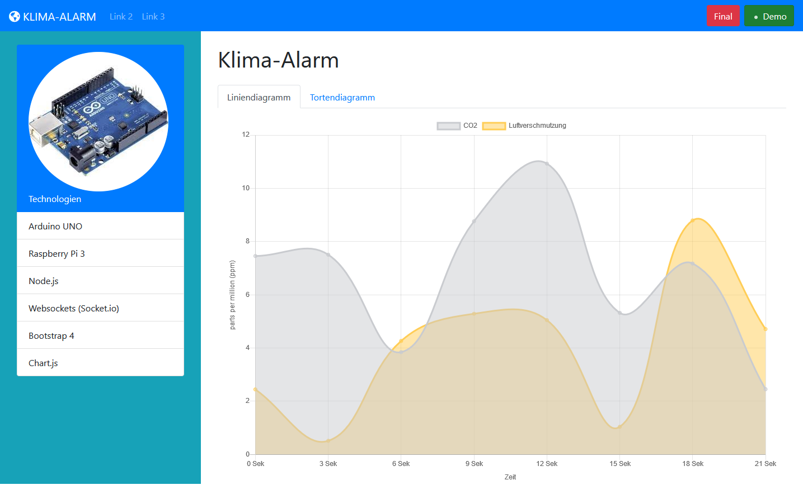
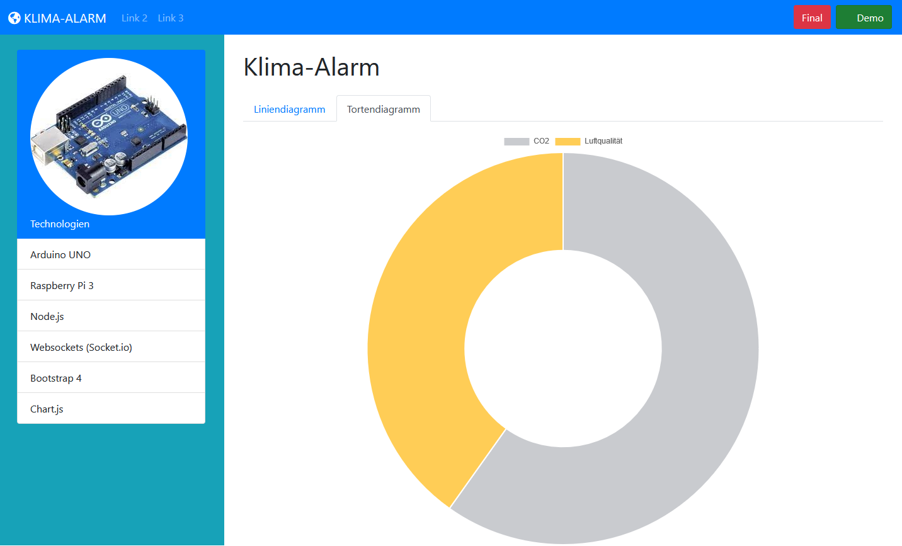

# Sensor-Multitool
## Target
The Sensor-Multitool shall be a server or portable program for 
* scientists
* schools
* programming beginners. 

## Usage
You will be able to select a type of sensor and this program will give you instruction how to wire it to an Arduino. 
After that you can hook that Arduino to a PC and this program will program your Arduino for that specific sensor. 
Now the program shows you all the values the sensor can measure in many different types of charts or tables. 

## For now
The program is a fork of [Klima-alarm](https://github.com/Jugendhackt/klima-alarm), 
which was a projekt from the _hackathon_ **"JugendHackt"**, where I worked one weekend with a couple of others to show the effects of greenhouse gases with a gas sensor. 

So the program as it is now is only able to da this part and isn't really easy to init without any knowledge of **arduinos, raspberrys, node.js** and so on.
But for this I want to simplify the use so that even teachers and sstudent in high school are able to use it. 

## Preview
| Line chart | Pie chart |
| ---------- | --------- |
|  |  |